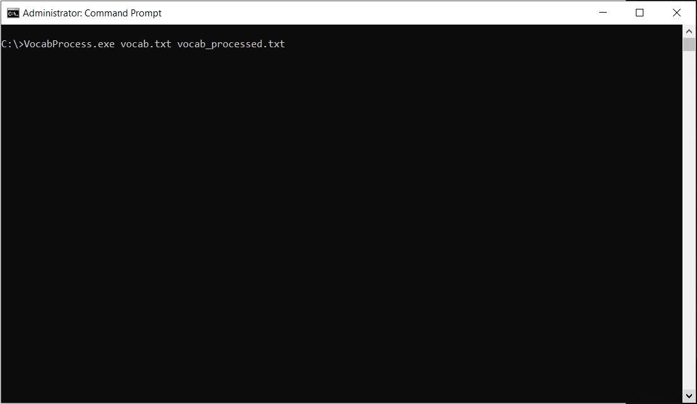
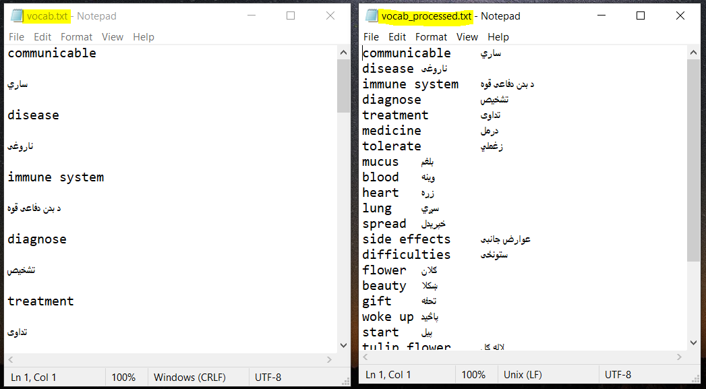

# Vocabulary Sorter:
A simple C# program to sort out a list of vocabulary and definitions.

# Demonstration:
Below is how your output file will look like after launching this program using the Windows CLI.

